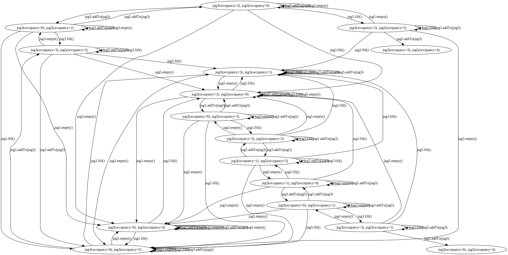
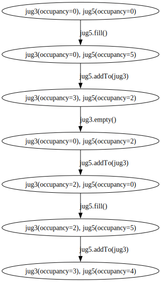
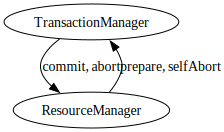
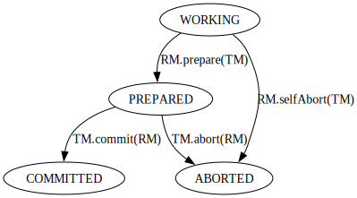
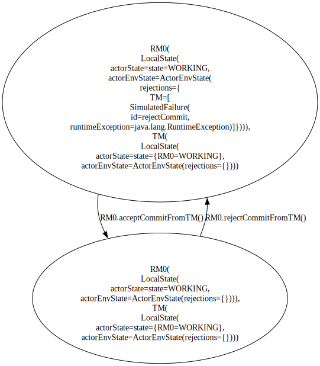
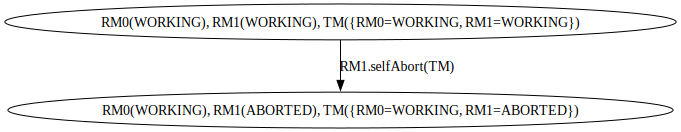
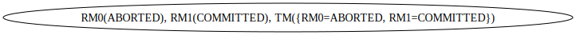
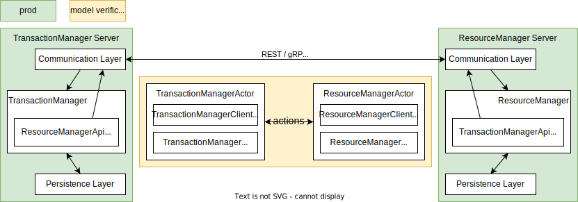

# Overview

Overcooked is a tool that provides a way to run formal verification against 
a distributed system, in the CI/CD pipeline, using the real code. 

In a distributed system, there are usually multiple actors. The distributed
system works by these actors interacting with each other. Their interactions
form a number of sequences, with different interleaving. The number of
these sequences grows rapidly as the number of actors and actions increase. It
may not be easy to reach a conclusion that all these sequences are allowed, or
in other words, the system does not break after each of all these sequences.

By exhausting all (\*) possible sequences, including simulating failures like
network partition, Overcooked verifies whether the distributed system's
invariants are honoured during and after these sequences of actions, in which
case we can be confident that the system's correctness is guaranteed. \
(\*) see [Limits](#limits)

Overcooked currently supports
[only JAVA](https://github.com/stephen-hlx/overcooked-rust), and it requires
the service and the client of the system's applications to have an in-memory
version of its implementations.

The remaining of this document comprises 4 main parts:
- [How does it work?](#how-does-it-work)
- [How to use it?](#how-to-use-it)
- [What Overcooked is not about?](#what-overcooked-is-not-about)
- [Limits](#limits)

# How does it work?

- A distributed system is said to be in a correct state if all its invariants
are honoured
- A distributed system's invariants are defined by its states satisfying a set
of conditions
- A distributed system's state comprises the states of each of its actors
- A state transition of the distributed system is the result of a single
action taken by one of its actors

Starting from an initial state of the distributed system, Overcooked triggers
all actions of each actor, one action per step, to exhaust the sequences of
all possible interleaving and verify that all of them leave the system in a
state that with all its invariants honoured. Overcooked also allows the
injection of failures by having an actor reject actions performed by one or
more specific actors, simulating situations like network partitioning.

### Quick Example
The [water pouring puzzle](https://en.wikipedia.org/wiki/Water_pouring_puzzle)
can be considered as 2 actors in a distributed system, one is a jug with a
capacity of 3 litres, and the other with 5 litres. Let's call them Jug3 and
Jug5. They both are able to perform following actions:
- empty itself
- fill itself (to the full capacity)
- add water to a different jug (till it empties itself or the other is full)

For a distributed system with these 2 actors, Jug3 and Jug5, the state machine
looks like this: \


Among these states, there are 2 of them with Jug5 holding 4 litres of water.
If the system has an invariant that neither of these 2 jugs can be holding 4
litres of water (Jug3 intrinsically cannot hold 4 litres of water), that means
the system has a bug in there allowing some paths leading to the states with
the invariants violated. With Overcooked, an invariant can be defined as Jug5
not holding 4 litres of water. Then, when Overcooked builds the state machine,
for every new state the invariant is checked and the paths leading to the
states with Jug5 holding 4 litres of water will be identified. Following is
one of the 2 paths: \


This example is included in the
[waterjug](sample/src/main/java/overcooked/sample/waterjug) package.


## Key Components

- [Actor and Action](#actor-and-action)
- [Local State](#local-state)
- [Global State](#global-state)
- [Invariant](#invariant)
- [In-Memory Implementation](#in-memory-implementation)
- [Failure Injection](#failure-injection)
- [Model Verifier](#model-verifier)

In the rest of this section, the
[Two Phase Commit](https://en.wikipedia.org/wiki/Two-phase_commit_protocol)
example ([code](sample/src/main/java/overcooked/sample/twophasecommit)) will be
frequently used to demonstrate how `TransactionManager` works multiple
`ResourceManagers` to commit a transaction together.

### Actor and Action
A distributed system consists of more than one actor. The system works by these
actors interacting with each other.

An action can be transitive or intransitive:
- A transitive action involves 2 actors: the action performer and the action
  receiver, e.g. Jug3 add water to Jug5 
- An intransitive action involves only the action performer, e.g. Jug3 empties
  itself

The Two Phase Commit example has two types of actors in the system,
`ResourceManager` and `TransactionManager`. The actions between these two
actors are: \


### Actor State
When talking about the correctness of a distributed system, ll that matters is
the state. A state change does not happen spontaneously. A state change is
always a result of an action. The state of an actor represents the state of an
individual actor at the application level.

An actor has its behaviour. It can perform an action against itself, and it can
also perform an action against a different actor. Each of these actions may or
may not transition the action's performer and receiver into a different state,
which can be described via a finite state machine.

The `ResourceManager` for example, has its own finite state machine: \
(RM: ResourceManager, TM: TransactionManager) \


### Actor Environment State
The state of the environment an actor lives in. It is used to keep the state
that indicates whether the actor accepts actions performed by a different
actor. It is a deny list based state, so by default, the list is empty and the
actor accepts actions performed by other actors in the system.

Following is an example:
 \
(For simplicity, most of the diagram in this document omits the Actor
Environment State because it makes the diagram big and hard to read)

### Local State
Local state consists of both the [Actor State](#actor-state) and the
[Actor Environment State](#actor-environment-state) of an actor, it looks like
the example in the Actor Environment State.

### Global State
A distributed system is made up of a number of actors. The system's state is
therefore a collection of the states of the actors. This collection is called
`GlobalState`.

Following is an example from the Two Phase Commit sample: \
(TM's local state consists of a view of the states of the RMs) \


### Invariant
A distributed system's correctness is defined by the upholding of its
invariants. Its invariants are defined by its global states satisfying a set of
conditions. For instance, one of the Two Phase Commit protocol's invariants
requires that if any of the ResourceManagers is `ABORTED`, no ResourceManager
can be in a state of `COMMITTED`. Therefore, the following global state would
be violating such an invariant: \


Another invariant example is that, TransactionManager should always have a
view of the ResourceManagers' states that is consistent with all
ResourceManagers' states.

### In-Memory Implementation


Model verification cares only the state of the actors in the distributed
system, and is agnostic to the network communication and the underlying
storage.

Actors in a distributed system interact with each other via the counterpart's
client, of which the implementation could be REST, gRPC, etc. The model
verification however, is not concerned with the communication implementation.
Instead, it needs an in-memory implementation of these clients to restore the
actors using their local states.

Similarly, service implementation may include a durable storage, e.g. AWS S3.
However, such integration could slow down and even complicate the restoration
of an actor. Therefore, an in-memory service implementation for Overcooked
simplifies the model verification.

#### Persona
Usually, actors in a system interact with each other via the counterpart's
client. For example, in production code, `ResourceManager` would use the
`TransactionManagerClient` to let the `TransactionManager` know that it is
prepared for commit:
```java
class ResourceManagerService {
  private final ResourceManager resourceManager;
  private final TransactionManagerClient transactionManagerClient;
  void processRequest(Request request) {
    if (shouldPrepareForCommit(request)) {
      resourceManager.prepare(transactionManagerClient);
    }
  }
}
```

To express interactions in this way, it requires two pairs of actors:
- `ResourceManager` vs `TransactionManagerClient`, e.g.
    ```
    resourceManager.prepare(transactionManagerClient);
    ```
- `TransactionManager` vs `ResourceManagerClient`, e.g.
    ```
    transactionManager.commit(resourceManagerClient);
    ```

To simplify this, Overcooked personifies the service and client as a single
actor and requires that both of the in-memory implementations of the service
and client share the same state:
```java
class ResourceManagerActor implements ResourceManagerClient, ResourceManager { }
class TransactionManagerActor implements TransactionManagerClient, TransactionManager { }
```
The interaction then can be represented as:
```
resourceManagerActor.prepare(transactionManagerActor);
transactionManagerActor.commit(resourceManagerActor);
```
More specifically, following is what the real definition of an action looks
like:
```
ActionTemplate.<ResourceManagerActor, TransactionManagerActor>builder()
  .actionPerformerId(actionPerformerId)
  .actionType(new TransitiveActionType(TM))
  .actionLabel("prepare")
  .action(ResourceManagerActor::prepare)
  .build()
```

### Failure Injection
Failures in a distributed system have the symptom of the service being
unreachable, either due to network issue (e.g. partition) or the node is
actually down. The observable symptom by the dependent systems would be an
exception thrown when accessing the service using the client. To simulate
such failures, Overcooked provides a way to specify that an actor (e.g.
`ResourceManager`) throws an exception when a specific actor (e.g.
`TransactionManager`) invokes a specific action (e.g. `commit`) of the actor.
In the following example, once this "rejectActionFrom" action is performed,
subsequent calls to `RM0.commit()` by `TM`will result in a `RuntimeException`
being thrown:
```
ActionTemplate.<ResourceManagerActor, Void>builder()
  .actionPerformerId(RM0)
  .actionType(new IntransitiveActionType())
  .actionLabel("rejectCommitFromTM")
  .action(((rm, unused) -> rm.rejectActionFrom(TM,
    new SimulatedFailure("rejectCommit",
      obj -> ((ResourceManagerActor) obj).commit(),
      new RuntimeException()))))
  .build()
```
This "rejectActionFrom" action simulates the transition from `RM0`, the
`ResourceManagerActor`, being reachable by `TM` to being unreachable.

Similarly, there is a corresponding reverse action named "acceptActionFrom" for
restoring connection to an actor. For example, the following "acceptActionFrom"
action
```
ActionTemplate.<ResourceManagerActor, Void>builder()
  .actionPerformerId(RM0)
  .actionType(new IntransitiveActionType())
  .actionLabel("acceptCommitFromTM")
  .action((rm, unused) -> rm.acceptActionFrom(TM))
  .build()
```
restores access to `RM0`, the `ResourceManagerActor` from `TM`, the
`TransactionManagerActor`.

### Model Verifier
The `ModelVerifier` encapsulates the necessities of running the model
verification. That includes implementations like:
- `ActorActionConfig` - the actors and the actions they can perform
- `ActorStateTransformerConfig` - the implementation that extracts the local
states from actors and reconstructs actors using a given local state
- `InvariantVerifier` - the verification implementation of a given
`GlobalState`

The `ModelVerifier` then produces an execution context that consists of the
finite state machine (FSM) of the distributed system and a set of the states
that violate the invariant specified, if there is any. This information can be
used to generate the paths from its initial state to the invariant violating
states.

For example:
```java
class TwoPhaseCommitModelVerifier {
  void run() {
    ModelVerifier modelVerifier = ModelVerifier.builder()
        .actorActionConfig(actorActionConfig())
        .actorStateTransformerConfig(actorStateTransformerConfig())
        .invariantVerifier(new TransactionStateVerifier())
        .build();

    StateMachineExecutionContext stateMachineExecutionContext =
        modelVerifier.runWith(initialGlobalState());
    
    ReportGenerator reportGenerator = ReportGenerator.builder()
        .analyser(new JgraphtAnalyser())
        .dotGraphExporter(DotGraphExporterFactory.create())
        .outputDirName(outputDirName)
        .build();
    Report report = reportGenerator.generate(stateMachineExecutionContext.getData());
  }
}
```


# How to use it?
Overcooked requires the system to be verified be implemented in a certain way
in order for it to work effectively. You will need:
- an in-memory implementation of each of the actors in the system
- an implementation to extract the local state of each actor
- an implementation to reconstruct the actors using their local states
- specifications of the actions that are going to take place between these
actors
- definition of the invariants of the system using the local states

The Two Phase Commit sample has an in-memory implementation for both the
client and service of the `ResourceManager`
- [InMemoryResourceManagerClient](sample/src/main/java/overcooked/sample/twophasecommit/modelverifier/InMemoryResourceManagerClient.java)
- [SimpleResourceManager](sample/src/main/java/overcooked/sample/twophasecommit/model/SimpleResourceManager.java)

as well as the `TransactionManager`:
- [InMemoryTransactionManagerClient](sample/src/main/java/overcooked/sample/twophasecommit/modelverifier/InMemoryTransactionManagerClient.java)
- [TransactionManager](sample/src/main/java/overcooked/sample/twophasecommit/model/SimpleTransactionManager.java)

For action specifications and invariants of the Two Phase Commit sample,
please see its
[modelverifier package](sample/src/main/java/overcooked/sample/twophasecommit/modelverifier).

# What Overcooked is not about?
- Neither atomicity nor idempotency at component level is of this library's
  concern. These are supposed to be verified at the design of the individual
  component.
- Nesting calls. For a system like:
  ```
   actor  actor  actor
     A      B      C
     │      │      │
    ┌┴┐     │      │
    │ │    ┌┴┐     │
    │ ├───►│ │    ┌┴┐
    │ │    │ ├───►│ │
    │ │    │ │◄───┤ │
    │ │◄───┤ │    └┬┘
    │ │    └┬┘     │
    └┬┘     │      │
     │      │      │
  ```
  Overcooked would only care the action between actorA and actorB. The reason
  is that when it comes to abstraction, actorB in this case, should be
  considered as a black box as actorC is just implementation details of actorB:
  - if actorB is stateless, then it effectively is just actorA communicating
    with actorC directly
  - if actorB is stateful:
    - if actorC is stateless, then it is just actorB that we care
    - if actorC is stateful, then the state change of actorB and actorC are in
      fact two distinct state changes and they should be
      - modelled separately (the state change of actorB and actorC can be
        observed as two distinct states)
      - or the state of actorC being part of the state of actorB (actorB and
        actorC are one actor)


# Limits
## Multiple state transitions combined
It is a common implementation for a service that, within one API call, there
are updates to the states of more than one actor. For example, Jug3 adds water
to Jug5:
- Jug3 reduces the amount of water it is holding
- Jug5 increases the amount of water it is holding

Regardless the order of the above 2 steps, each of them triggers a **global**
state change. And a partial change is observable, by a third actor: when Jug3
has reduced its holding and before Jug5 has increased its, or the other way
around. However, Overcooked currently can only model it as an atomic step. That
means when the state machine is exploring the state space, the states
representing the partial change will be missing.

### Is this really a problem?
In distributed systems, or as general as an environment with parallelism,
we should always assume that shared information becomes stale once it is
obtained. The partial change described above being observable although would
result in an inconsistent view of the data, it does not change the fact that
any side effect made upon the information, potentially stale, should be
validated at the time of the side effect is made. Or in other words,
versioning or fencing should be used to ensure the correctness of the side
effect. This type of correctness guarantee could easily be tested at
component level and may not necessarily be a concern of this library.

### Potential Workaround
A workaround requires the service changing its implementation to having the
action that updates states of multiple actors split into multiple ones that
update state of only one actor. However, this might require a design change
that may not always work.

## Ergonomics
As demonstrated in the samples in section
[How does it work?](#how-does-it-work), the set-up of the model verification is
rather tedious. It involves:
- creating an actor, the persona that combines both the server and the service
  client
- describing the interactions between the actors as well as the failures


# Origin of this project
This library was inspired by the thesis
"[Stefanescu, 2006] Stefanescu, A. (2006). Automatic Synthesis of Distributed
Transition Systems. PhD thesis, Universitat Stuttgart." and by a former project
at work. The former project was about a data pipeline that consists of multiple
data sources funnelling into a single component. Back then we were not able to
verify whether the design and implementation had a flaw due to the large number
of possible interleaving of events happening between the components. Hence, the
conception of this library.

The samples included in this library were inspired by the
[examples of TLA+](https://lamport.azurewebsites.net/video/videos.html).

# License

This project is licensed under the [MIT license](LICENSE).

# Why is the name "Overcooked"?
When I finally got around doing this, I needed a name for it. I asked my 
wife for a name after describing what it does, "a tool that verifies that 
when a couple of actors can simultaneously perform their actions, are there 
any certain sequence of actions by certain actors that are going to cause a 
problem", she immediately recalled the video game we played at our friends' 
place, [Overcooked](https://en.wikipedia.org/wiki/Overcooked). I was like, 
"aha, that's it!".
