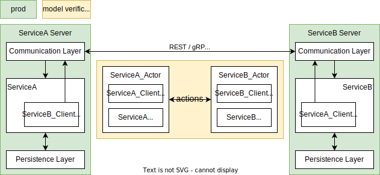

# Overcooked

## Overview

Overcooked is a tool that provides a way to run formal verification against 
a distributed system, in the CI/CD pipeline, using the real code. 

In a distributed system, there are usually multiple actors. The distributed
system works by these actors interacting with each other. Their interactions
form a number of sequences, with different interleaving. The number of
these sequences grows rapidly as the number of actors and actions increase. It
may not be easy to reach a conclusion that all these sequences are allowed, or
in other words, the system does not break after each of all these sequences.

By exhausting all possible sequences, Overcooked verifies whether or not the
distributed system's invariants are honoured during and after these sequences
of actions, in which case we can be confident that the system's correctness
is guaranteed.

Overcooked currently supports
[only JAVA](https://github.com/stephen-hlx/overcooked-rust), and it requires
the service and the client of the system's applications to have an in-memory
version of its implementations.

The remaining of this document comprises 2 main parts:
- [How does it work?](#how-does-it-work)
- [How to use it?](#how-to-use-it)
- [Next Steps](#next-steps)

## How does it work?

- A distributed system is said to be in a correct state if all its invariants
are honoured
- A distributed system's invariants are defined by its states satisfying a set
of conditions
- A distributed system's state comprises the states of each of its actors
- A state transition of the distributed system is the result of a single
action taken by one of its actors

Starting from an initial state of the distributed system, Overcooked triggers
all actions of each actors to exhaust the sequences of all possible
interleaving and verify that all of them leave the system in a state that with
all its invariants honoured.

This library has following key components:

- [Actor and Action](#actor-and-action)
- [Local State](#local-state)
- [Global State](#global-state)
- [Invariant](#invariant)
- [In-Memory Implementation](#in-memory-implementation)
- [Model Verifier](#model-verifier)

### Actor and Action
A distributed system consists of more than one actor.
The system works by these actors interacting with each other.

The
[Two Phase Commit](https://en.wikipedia.org/wiki/Two-phase_commit_protocol)
example ([code](sample/src/main/java/overcooked/sample/twophasecommit)) has
two types of actors in the system, `ResourceManager` and `TransactionManager`.
The actions between these two actors are: \


### Local State
The local state of an actor represents the state of an individual actor.

An actor has its behaviour. It can perform an action against itself, and it can
also perform an action against a different actor. Each of these actions may or
may not transition the action's performer and receiver into a different state,
which can be described via a finite state machine.

The `ResourceManager` for example, has its own finite state machine: \
(RM: ResourceManager, TM: TransactionManager) \


### Global State
A distributed system is made up of a number of actors. The system's state is
therefore a collection of the states of the actors. This collection is called
`GlobalState`.

Following is an example from the Two Phase Commit sample: \
(TM's local state consists of a view of the states of the RMs) \


### Invariant
A distributed system's correctness is defined by the upholding of its
invariants. Its invariants are defined by its global states satisfying a set of
conditions. For instance, one of the Two Phase Commit protocol's invariants
requires that if any of the ResourceManagers is `ABORTED`, no ResourceManager
can be in a state of `COMMITTED`. Therefore, the following global state would
be violating such an invariant:


Another invariant example is that, TransactionManager should always have a
view of the ResourceManagers' states that is consistent with all
ResourceManagers' states.

### In-Memory Implementation


Model verification cares only the state of the actors in the distributed
system, and is agnostic to the network communication and the underlying
storage.

Actors in a distributed system interact with each other via the counterpart's
client, of which the implementation could be REST, gRPC, etc. The model
verification however, is not concerned with the communication implementation.
Instead, it needs an in-memory implementation of these clients to restore the
actors using their local states.

Similarly, service implementation may include a durable storage, e.g. AWS S3.
However, such integration could slow down and even complicate the restoration
of an actor. Therefore, an in-memory service implementation for Overcooked
simplifies the model verification.

#### Persona
Usually, actors in a system interact with each other via the counterpart's
client. For example, in production code, `ResourceManager` would use the
`TransactionManagerClient` to let the `TransactionManager` know that it is
prepared for commit:
```java
class ResourceManagerService {
  private final ResourceManager resourceManager;
  private final TransactionManagerClient transactionManagerClient;
  void processRequest(Request request) {
    if (shouldPrepareForCommit(request)) {
      resourceManager.prepare(transactionManagerClient);
    }
  }
}
```

To express interactions in this way, it requires two pairs of actors:
- `ResourceManager` vs `TransactionManagerClient`, e.g.
    ```
    resourceManager.prepare(transactionManagerClient);
    ```
- `TransactionManager` vs `ResourceManagerClient`, e.g.
    ```
    transactionManager.commit(resourceManagerClient);
    ```

To simplify this, Overcooked personifies the service and client as a single
actor and requires that both of the in-memory implementations of the service
and client share the same state:
```java
class ResourceManagerActor implements ResourceManagerClient, ResourceManager { }
class TransactionManagerActor implements TransactionManagerClient, TransactionManager { }
```
The interaction then can be represented as:
```
resourceManagerActor.prepare(transactionManagerActor);
transactionManagerActor.commit(resourceManagerActor);
```
or more specifically, as per the model verification's requirement:
```
ActionTemplate.<ResourceManagerActor, TransactionManagerActor>builder()
    .actionPerformerId(actionPerformerId)
    .actionType(new TransitiveActionType(TM))
    .actionLabel("prepare")
    .action(ResourceManagerActor::prepare)
    .build()
```

### Model Verifier
The `ModelVerifier` encapsulates the necessities of running the model
verification. That includes implementations like:
- `ActorActionConfig` - the actors and the actions they can perform
- `ActorStateTransformerConfig` - the implementation that extracts the local
states from actors and reconstructs actors using a given local state
- `InvariantVerifier` - the verification implementation of a given
`GlobalState`

The `ModelVerifier` then produces an execution context that consists of the
finite state machine (FSM) of the distributed system and a set of the states
that violate the invariant specified, if there is any. This information can be
used to generate the paths from its initial state to the invariant violating
states.

For example:
```java
class TwoPhaseCommitModelVerifier {
  void run() {
    ModelVerifier modelVerifier = ModelVerifier.builder()
        .actorActionConfig(actorActionConfig())
        .actorStateTransformerConfig(actorStateTransformerConfig())
        .invariantVerifier(new TransactionStateVerifier())
        .build();

    StateMachineExecutionContext stateMachineExecutionContext =
        modelVerifier.runWith(initialGlobalState());
    
    ReportGenerator reportGenerator = ReportGenerator.builder()
        .analyser(new JgraphtAnalyser())
        .dotGraphExporter(DotGraphExporterFactory.create())
        .outputDirName(outputDirName)
        .build();
    Report report = reportGenerator.generate(stateMachineExecutionContext.getData());
  }
}
```
Following is part of the output of the
[waterjar](sample/src/main/java/overcooked/sample/waterjar) sample, which has
2 states violating the invariant. And the shortest path from the initial state
to one of the violating states is \
 \
(compared to "Two Phase Commit", the "waterjar" sample has invariant violating
states and a relatively smaller state space, making it easier to display here)


## How to use it?
Overcooked requires the system to be verified be implemented in a certain way
in order for it to work effectively. You will need:
- an in-memory implementation of each of the actors in the system
- an implementation to extract the local state of each actors
- an implementation to reconstruct the actors using their local states
- specifications of the actions that are going to take place between these
actors
- definition of the invariants of the system using the local states

The Two Phase Commit sample has an in-memory implementation for both the
client and service of the `ResourceManager`
- [InMemoryResourceManagerClient](sample/src/main/java/overcooked/sample/twophasecommit/modelverifier/InMemoryResourceManagerClient.java)
- [InMemoryResourceManager](sample/src/main/java/overcooked/sample/twophasecommit/modelverifier/InMemoryResourceManager.java)

as well as the `TransactionManager`:
- [InMemoryTransactionManagerClient](sample/src/main/java/overcooked/sample/twophasecommit/modelverifier/InMemoryTransactionManagerClient.java)
- [InMemoryTransactionManager](sample/src/main/java/overcooked/sample/twophasecommit/modelverifier/InMemoryTransactionManager.java)

For action specifications and invariants of the Two Phase Commit sample,
please see its
[modelverifier package](sample/src/main/java/overcooked/sample/twophasecommit/modelverifier).

## Next Steps
- [Make it an option to define a sequence of actions for an actor](https://github.com/stephen-hlx/overcooked/issues/26)


## Origin of this project
This library was inspired by the thesis
"[Stefanescu, 2006] Stefanescu, A. (2006). Automatic Synthesis of Distributed
Transition Systems. PhD thesis, Universitat Stuttgart." and by a former project
at work. The former project was about a data pipeline that consists of multiple
data sources funnelling into a single component. Back then we were not able to
verify whether the design and implementation had a flaw due to the large number
of possible interleaving of events happening between the components. Hence the
conception of this library.

The samples included in this library were inspired by the
[examples of TLA+](https://lamport.azurewebsites.net/video/videos.html).

## License

This project is licensed under the [MIT license](LICENSE).

## Why is the name "Overcooked"?
When I finally got around doing this, I needed a name for it. I asked my 
wife for a name after describing what it does, "a tool that verifies that 
when a couple of actors can simultaneously perform their actions, are there 
any certain sequence of actions by certain actors that are going to cause a 
problem", she immediately recalled the video game we played at our friends' 
place, [Overcooked](https://en.wikipedia.org/wiki/Overcooked). I was like, 
"aha, that's it!".
